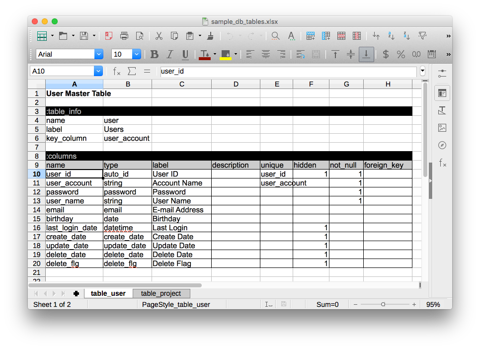

# Excel Format

## Overview

- 1シートにつき1つのテーブルを表現する。

## Column Definition

### column_name

カラム名。
実際に生成されるテーブル上でのカラムの物理名称として使われる。

### type

カラムの種類。
一般的なDBMSが定義するデータ型だが、 Excellent Db が拡張する論理的な型が幾つか追加されている。

詳しくは [Column Types](column_types.md) を参照。

### label

カラムの論理名称。フォーム生成時に入力欄のラベルとして使用される。

### description

カラムの説明。人語で記述。

### unique

`1` をセットして、unique 制約をつける。

### primary

`1` をセットして、primary key 制約をつける。

### index

`1` をセットして、INDEXを生成する。

### hidden

`1` をセットして、非表示にする。
非表示にされたカラムは、フォームや一覧に表示されなくなる。
ユーザーは意識する必要がなく、アプリケーションが自動的に操作するカラムに設定する。

### not_null

`1` をセットして、 NOT NULL 制約をつける。

### foreign_key

foreign key 制約。外部キーとするテーブル名とカラム名を記述する。
